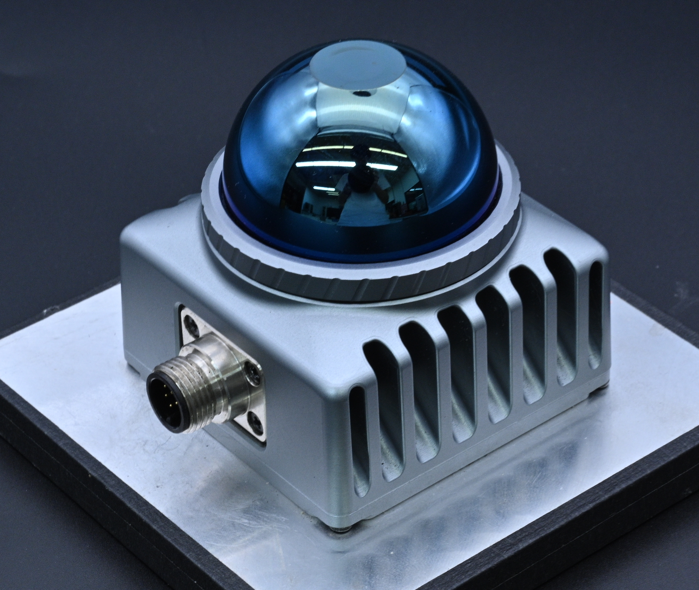
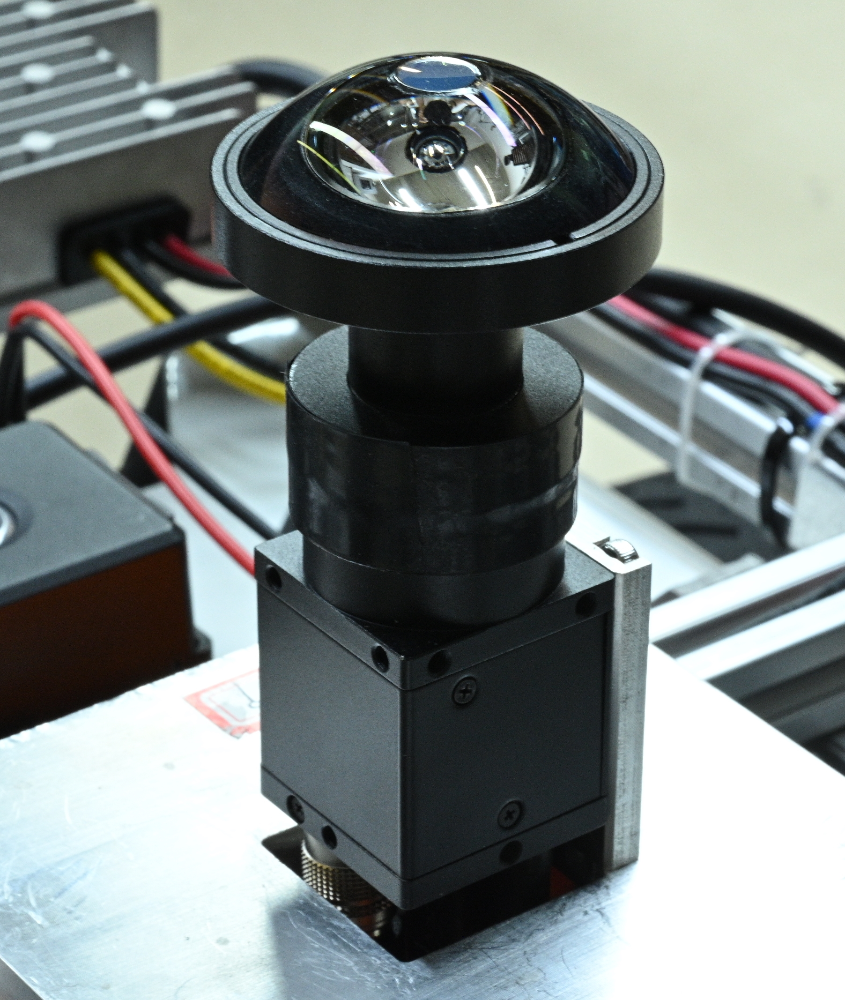
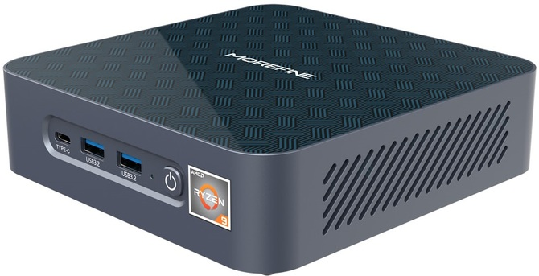

# Livox_Fisheye_Fusion (LFF)
LFF project is an automatic calibration method for Livox mid-360 LiDAR and Fisheye Camera. The package is developed by MIAO Ziliang, He Buwei, Xie Wenya, WANG Zhenhu (ISEE Lab, SDIM, SUSTech), directed by Prof.HONG Xiaoping (ISEE Lab, SDIM, SUSTech).


## 1. Prerequisites
### 1.1 **Ubuntu** and **ROS**
Version: Ubuntu 18.04.

Version: ROS Melodic. 

Please follow [ROS Installation](http://wiki.ros.org/ROS/Installation) to install.
### 1.2. **ceres-solver**
Version: ceres-solver 2.1.0

Please follow [Ceres-Solver Installation](http://ceres-solver.org/installation.html) to install.
### 1.3. **PCL**
Version: PCL 1.7.4

Version: Eigen 3.3.4

Please follow [PCL Installation](http://www.pointclouds.org/downloads/linux.html) to install.
### 1.3. **OpenCV**
Version: OpenCV 3.2.0

Please follow [OpenCV Installation](https://opencv.org/) to install.
### 1.4. **mlpack**
Version: mlpack 3.4.2

Please follow [mlpack Installation](https://mlpack.org/) to install.

## 2. Build 
Clone the repository and catkin_make:

```
    cd ~/catkin_ws/src/
    git clone https://github.com/SDIM-Fisheye/Livox_Fisheye_Fusion.git
    cd ../
    catkin_make
    source ~/catkin_ws/devel/setup.bash
```
note: package name is data_process


## 3. Run
### For Livox Mid-360

```
    roslaunch loam_livox livox.launch
    roslaunch livox_ros_driver livox_lidar.launch
```
### Transform .lvx file to rosbag
Get into the workspace of livox driver.
```
    catkin_make 
    source ./devel/setup.bash
    roslaunch livox_ros_driver lvx_to_rosbag.launch <lvx_file_path>
```
<lvx_file_path> is the absolute path of .lvx file.
### Transform rosbag file to .pcd files
```
    rosrun pcl_ros bag_to_pcd <rosbag_file_path> <topic> <pcds_directory_path>
```
<rosbag_file_path> is the path of rosbag file, <topic> is /livox/lidar for livox lidar, <pcds_directory_path> is the output directory path of .pcd files.

## 4. Results
### 4.1. Hardwares

 <table>
	<tr>
	    <th>Hardware Platform</th>
	    <th>Item Names</th>
	    <th>Pictures</th>
	    <th>Shopping Links</th> 
	</tr >
	<tr >
            <td rowspan="4"></td>
	    <td>Livox Mid-360 </td>
	    <td align="center" valign="middle"></td>
            <td align="center" valign="middle">  <a href ="https://www.livoxtech.com"> Lidar </a> </td>
	</tr>
	<tr>
	    <td> MV-Fisheye Camera</td>
	    <td align="center" valign="middle"></td>
	    <td align="center" valign="middle">  <a href ="https://en.hikrobotics.com/vision/visioninfo.htm?type=42&oid=2451"> Camera </a> </td>
	</tr>
	<tr>
	    <td>Morefine S500+</td>
	    <td align="center" valign="middle"></td>
            <td align="center" valign="middle">  <a href =https://morefines.com/products/mini-pc-s500-enclosure> Mini-Computer </a> </td>
	</tr>
	<tr>
	    <td> Scout-mini </td>
	    <td align="center" valign="middle"></td>
	    <td align="center" valign="middle">  <a href ="http://www.agilex.ai/index/product/id/3?lang=zh-cn"> Robot Chassis </a> </td>
	</tr>
</table>


## 5. Acknowledgements
Thanks for [CamVox](https://github.com/ISEE-Technology/CamVox), [Livox-SDK](https://github.com/Livox-SDK/livox_camera_lidar_calibration). [OCamCalib MATLAB Toolbox](https://sites.google.com/site/scarabotix/ocamcalib-omnidirectional-camera-calibration-toolbox-for-matlab).
Thanks for the guidance of Prof.HONG Xiaoping and [ISEE-Lab](https://isee.technology/).
