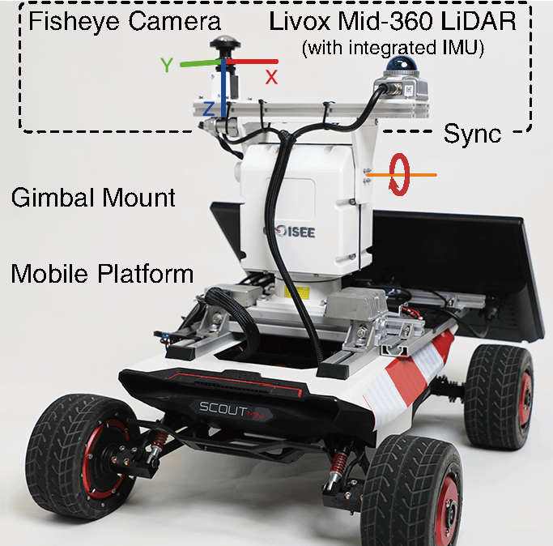
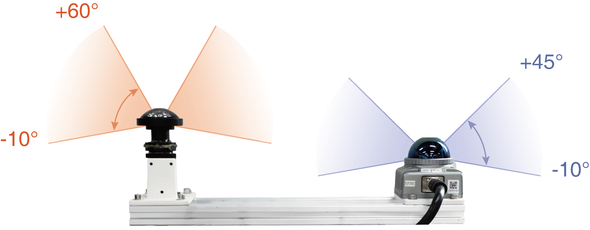
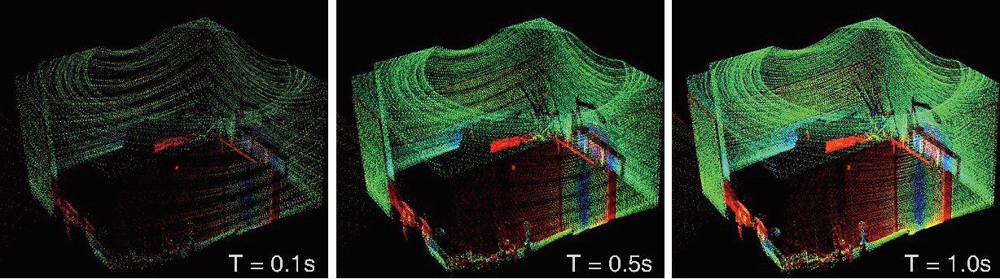
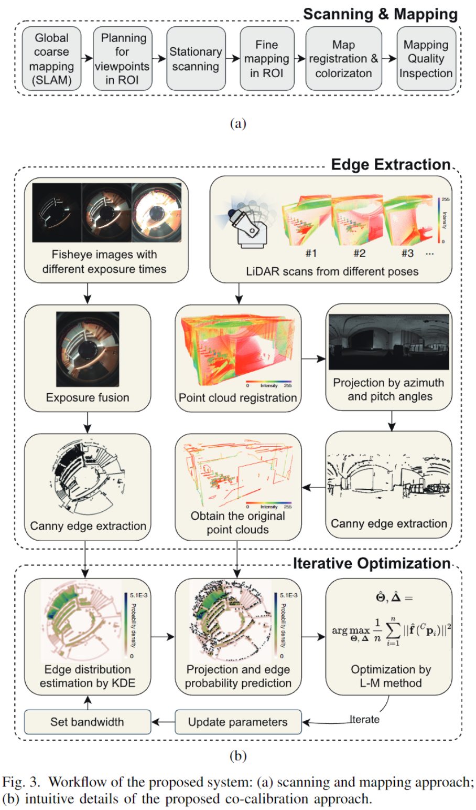
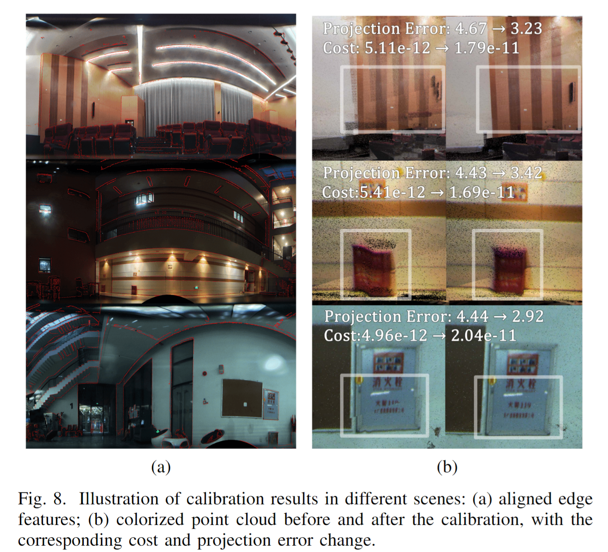

# Coarse-to-fine Hybrid 3D Mapping System with Co-calibrated Omnidirectional Camera and Non-repetitive Mid-360 LiDAR
This work is developed by Ziliang Miao, Buwei He, Wenya Xie, supervised by Prof.Xiaoping Hong ([ISEE-Lab](https://isee.technology/), SDIM, SUSTech), and is accepted by IEEE Robotics and Automation Letters (RA-L).

Pre-print Paper: https://arxiv.org/pdf/2301.12934.pdf

Demo Video: https://www.youtube.com/watch?v=Uh0C9VL9YEQ

## 0. Abstract
This paper presents a novel 3D mapping robot with an omnidirectional field-of-view (FoV) sensor suite composed of a non-repetitive LiDAR (Livox Mid-360) and an omnidirectional camera (please consult Huanjun Technology, panoholic). Thanks to the non-repetitive scanning nature of the LiDAR, an automatic targetless co-calibration method is proposed to simultaneously calibrate the intrinsic parameters for the omnidirectional camera and the extrinsic parameters for the camera and LiDAR, which is crucial for the required step in bringing color and texture information to the point clouds in surveying and mapping tasks. Comparisons and analyses are made to target-based intrinsic calibration and mutual information (MI)-based extrinsic calibration, respectively. With this co-calibrated sensor suite, the hybrid mapping robot integrates both the odometry-based mapping mode and stationary mapping mode. Meanwhile, we proposed a new workflow to achieve coarse-to-fine mapping, including efficient and coarse mapping in a global environment with odometry-based mapping mode; planning for viewpoints in the region-of-interest (ROI) based on the coarse map (relies on the previous work); navigating to each viewpoint and performing finer and more precise stationary scanning and mapping of the ROI. The fine map is stitched with the global coarse map, which provides a more efficient and precise result than the conventional stationary approaches and the emerging odometry-based approaches, respectively.





## 1. Workflow


## 2. Co-calibration Results


## 3. Prerequisites
### 3.1 **Ubuntu** and **ROS**
Version: Ubuntu 18.04.

Version: ROS Melodic. 

Please follow [ROS Installation](http://wiki.ros.org/ROS/Installation) to install.
### 3.2. **ceres-solver**
Version: ceres-solver 2.1.0

Please follow [Ceres-Solver Installation](http://ceres-solver.org/installation.html) to install.
### 3.3. **PCL**
Version: PCL 1.7.4

Version: Eigen 3.3.4

Please follow [PCL Installation](http://www.pointclouds.org/downloads/linux.html) to install.
### 3.4. **OpenCV**
Version: OpenCV 3.2.0

Please follow [OpenCV Installation](https://opencv.org/) to install.
### 3.5. **mlpack**
Version: mlpack 3.4.2

Please follow [mlpack Installation](https://www.mlpack.org/doc/mlpack-3.4.2/doxygen/build.html) to install.


### 3.6 Livox SDK and Livox ROS Driver
The SDK and driver is used for dealing with Livox LiDAR.
Remenber to install [Livox SDK](https://github.com/Livox-SDK/Livox-SDK) before [Livox ROS Driver](https://github.com/Livox-SDK/livox_ros_driver).

### 3.7 MindVision SDK
The SDK of the fisheye camera is in [MindVision SDK](http://www.mindvision.com.cn/rjxz/list_12.aspx?lcid=138).

## 4. Run Co-calibration
### Sensors:
Currently, this cocalibration method only supports omnidirectional camera and non-repetitive scanning LiDAR (Livox).

If you want to calibrate the monocular camera and the Livox LiDAR, please replace the omnidirectional camera model to monocular camera model and modify the corresponding parameters of optimization.

We will consider supporting other types of LiDAR in the future.

### Data:
Make the data, (dataset_name), cocalibration directories, refer to the file structure below.

Rename the accumulated non-repetitive scanned point cloud "full_fov_cloud.pcd", rename the hdr image "hrd_image.bmp".

Put the two raw files into ~/cocalibration/data/(dataset_name)/cocalibration directory.
### Config:
Modify the parameters in the config file, cocalibration.yaml.
### File stucture:
```bash
├── cocalibration
│   ├── build
│   ├── config
│   │   └── cocalibration.yaml
│   ├── data
│   │   └── (dataset_name)
│   │       └── cocalibration
│   │           ├── edges
│   │           │   ├── lidar_1_filtered.bmp
│   │           │   ├── lidar_2_canny.bmp
│   │           │   ├── lidar_edge_image.bmp
│   │           │   ├── lidar_edge_cloud.pcd
│   │           │   ├── omni_1_filtered.bmp
│   │           │   ├── omni_2_canny.bmp
│   │           │   └── omni_edge_image.bmp
│   │           ├── results
│   │           │   ├── fusion_image_init.bmp
│   │           │   ├── fusion_image_(bandwidth).bmp
│   │           │   ├── cocalib_init.txt
│   │           │   └── cocalib_(bandwidth).txt
│   │           ├── full_fov_cloud.pcd
│   │           ├── flat_lidar_image.bmp
│   │           └── hdr_image.bmp
│   ├── launch
│   │   └── cocalibration.launch
│   ├── include
│   │   ├── common_lib.h
│   │   ├── define.h
│   │   ├── lidar_process.h
│   │   ├── omni_process.h
│   │   └── optimization.h
│   ├── python_scripts
│   │   └── image_process
│   │       ├── omni_image_mask.png
│   │       ├── lidar_flat_image_mask.png
│   │       └── edge_extraction.py
│   ├── src
│   │   ├── lidar_process.cpp
│   │   ├── omni_process.cpp
│   │   ├── optimization.cpp
│   │   └── cocalibration.cpp
│   ├── package.xml
│   └── CMakeLists.txt
├── ReadMe.md
├── .git
└── .gitignore
```
### Commands:
```
    cd ~/$catkin workspace$
    catkin_make
    source ./devel/setup.bash
    roslaunch cocalibration cocalibration.launch
```

## 5. Acknowledgements
Thanks for [CamVox](https://github.com/ISEE-Technology/CamVox), [Livox-SDK](https://github.com/Livox-SDK/livox_camera_lidar_calibration), [OCamCalib MATLAB Toolbox](https://sites.google.com/site/scarabotix/ocamcalib-omnidirectional-camera-calibration-toolbox-for-matlab), [Fast-LIO](https://github.com/hku-mars/FAST_LIO), and thanks to the help of Wenquan Zhao, Xiao Huang, Jian Bai.
